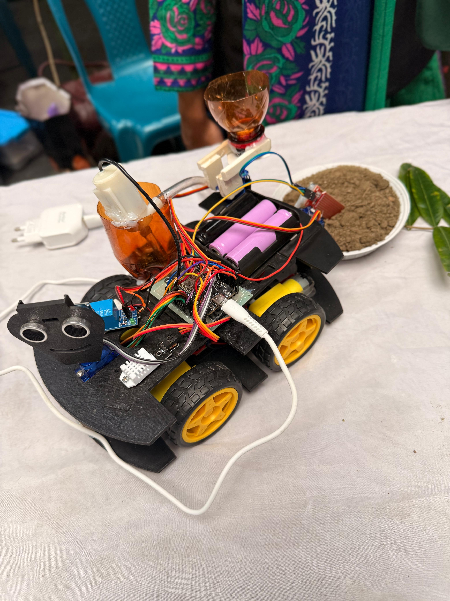
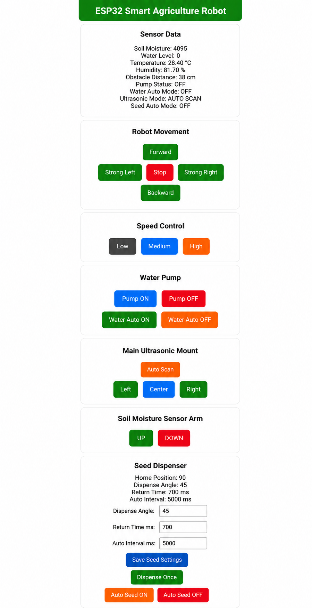

# Farming-Robot-for-Smart-Irrigation-and-Rice-Crop-Monitoring
An ESP32-based smart farming robot for automated irrigation, real-time rice crop monitoring, environmental sensing, and disease detection using IoT and AI technologies.

## Components Used

### Microcontroller
- ESP32 Development Board

### Sensors
- Capacitive Soil Moisture Sensor
- DHT22 Temperature & Humidity Sensor
- Water Level Sensor
- HC-SR04 Ultrasonic Sensor

### Actuators
- DC Water Pump
- Relay Module
- SG90 Servo Motors (3x)
- DC Geared Motors (2x)

### Motor Control
- L298N Motor Driver Module

### Mechanical Components
- Robot Chassis
- Wheels
- Caster Wheel
- Seed Hopper
- Seed Dispensing Mechanism
- Water Tank
- Pipes and Spray Nozzle

### Power Supply
- Rechargeable Li-ion Battery Pack
- DC-DC Buck Converter

### Structural Components
- Acrylic/PVC Frame
- Mounting Brackets
- Nuts & Bolts

### Miscellaneous
- Jumper Wires
- PCB
- Switch
- LED Indicators
- Terminal Connectors

## Circuit Diagram

The circuit diagram of the proposed smart agriculture robot is shown below.

  

---

## Arduino Code

The project is developed using the **ESP32 Development Board** and programmed in the **Arduino IDE**.

Before running the project, make sure the required libraries are installed.

### Required Libraries

- WiFi.h
- WebServer.h
- DHT.h
- ESP32Servo.h

### Source Code

The complete Arduino source code is available below.

👉 **[Smart Agriculture Robot Code](Arduino_Code/Smart_Agriculture_Robot.ino)**
## Project Photos

The following images show the hardware prototype and the web dashboard of the smart agriculture robot.
### Robot Prototype

  

### Web Dashboard

  

The robot hosts a local web server using the ESP32 Wi-Fi module. Through the dashboard, users can:

Monitor live sensor readings
Control robot movement
Turn irrigation ON/OFF
Enable automatic irrigation
Operate the seed dispenser
Control ultrasonic scanning
Monitor environmental conditions in real time

## How it Works
ESP32 Development Board is the primary controlling board of the smart agriculture robot. It receives real-time data from all the sensors and controls the motor, servo, and irrigation systems based on the processed data.

DHT22 Temperature and Humidity Sensor is used to determine the surrounding temperature and relative humidity. Digital readings of the sensor are used to check the environmental conditions for rice growth.

Capacitive Soil Moisture Sensor is used to check the level of soil moisture continuously. When soil moisture becomes less than the threshold value set by the user and automatic mode is turned on, ESP32 controls the irrigation system to water the crops.

Water Level Sensor is used to measure the quantity of water present in the tank. Before operating the water pump, ESP32 checks the water level in the tank to ensure that there is enough water available in it.The HC-SR04 Ultrasonic Sensor calculates the distance of the robot from the nearest obstacles. The sensor is mounted on the servo motor and keeps scanning the surroundings at various angles, thus helping the robot to detect obstacles.

The L298N Motor Driver acts as a controller for the DC geared motors which enable the robot to move forward, backward, left and right. The three servo motors help in controlling the arm for soil moisture sensors, ultrasonic scanner, and seed dispenser.

ESP32 is capable of creating its own Wi-Fi Access Point and hosting an internal web server. Through the use of smart phone or computer, the user can access the robot to monitor the real-time sensor readings and control the actions of the robot including movement, irrigation, ultrasonic scanning and seed dispenser.

For future extension of the project, ESP32-CAM takes images of rice leaves and the MobileViT deep learning model is utilized for detecting various rice diseases such as Brown Spot, Bacterial Leaf Blight, Leaf Smut, and Tungro.

## Features

- Smart irrigation using soil moisture monitoring
- Real-time temperature and humidity monitoring
- Water level monitoring
- Obstacle detection using ultrasonic sensor
- Automatic seed dispensing
- Wi-Fi based web dashboard
- Manual and automatic irrigation modes
- Adjustable robot speed and movement control
- AI-based rice leaf disease detection (Future Work)

## Applications

- Smart Farming
- Precision Agriculture
- Rice Field Monitoring
- Automated Irrigation
- Agricultural Research
- Educational and IoT Projects

## Future Improvements

- GPS-based autonomous navigation
- Mobile application support
- Cloud data storage
- Solar-powered charging system
- Fertilizer recommendation
- AI-based crop yield prediction

## References

1. *Exploiting the Internet Resources for Autonomous Robots in Agriculture* (2023)

2. *Research Progress on Autonomous Operation Technology for Agricultural Equipment in Large Fields* (2024)

3. *Evaluating an Autonomous Electric Robot for Real Farming Applications* (2024)

4. *A Hybrid Ensemble Framework for Smart Irrigation: Optimizing Water Management in Precision Agriculture* (2026)

5. *Rice Leaf Disease Identification and Classification Using Machine Learning Techniques: A Comprehensive Review*

6. *Towards Paddy Rice Smart Farming: A Review on Big Data, Machine Learning, and Rice Production Tasks*

7. *A Comprehensive Review of Sensing, Control, and Networking in Agricultural Robots: From Perception to Coordination*

8. *Deep Learning Based Models for Paddy Disease Identification and Classification: A Systematic Survey*
